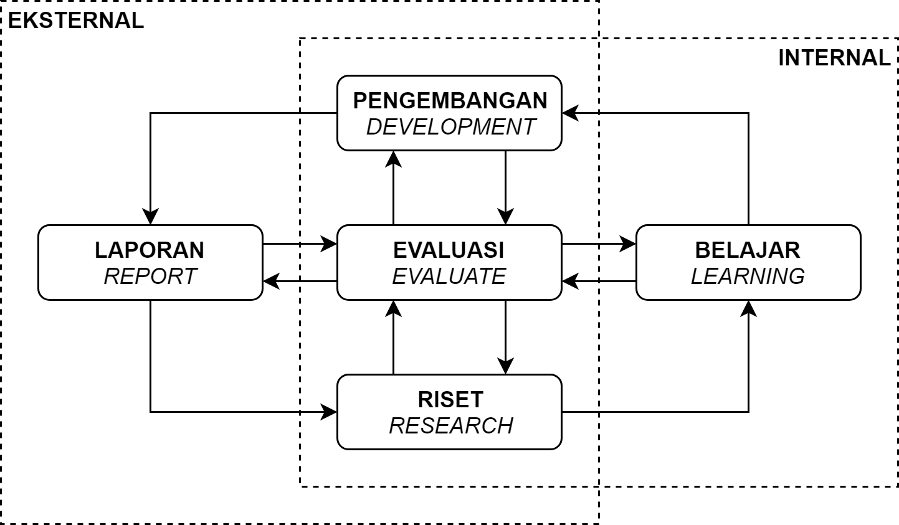

 

# vivaldi

Proyek vivaldi merupakan proyek dokumentasi pengerjaan tesis/penelitian dengan topik "Penggunaan _Recurrent Neural Network_ di bidang sumberdaya air". _Repository_ ini saya gunakan sebagai tempat menyimpan seluruh pekerjaan saya, dari catatan, _jupyter notebook_, pengerjaan tesis, jurnal perkembangan, dlsbnya. 

---

Jika Anda mengunjungi halaman ini karena _jupyter notebook_ atau laporan, berikut pranala penting terkait produk (penelitian) yang telah tersedia:

Daftar Pranala Buku:

- [Pranala Google Colab](https://colab.research.google.com/drive/1bx3ak_20dcJ7VdGR-djysLIxLaX7pRI2), format Google Colab versi terakhir
- [Pranala Github](https://github.com/taruma/vivaldi/blob/master/notebook/github_taruma_demo_lstm_rr.ipynb), format .ipynb versi 1.0.0
- [Lihat melalui NBViewer](https://nbviewer.jupyter.org/github/taruma/vivaldi/blob/master/notebook/github_taruma_demo_lstm_rr.ipynb), format .ipynb versi Github
- [Unduh Laporan](https://github.com/taruma/vivaldi/blob/master/pdf/taruma_lstm_rr_laporan.pdf?raw=true), format PDF versi 1.0.0 dengan _source code_ + _outputs_
- [Unduh Laporan (rapih)](https://github.com/taruma/vivaldi/blob/master/pdf/taruma_lstm_rr_laporan_rapih.pdf?raw=true), format PDF versi 1.0.0 hanya _outputs_*
- [Unduh Catatan](https://github.com/taruma/vivaldi/blob/master/pdf/taruma_lstm_rr_catatan.pdf?raw=true), format PDF versi 1.0.0

Daftar Pustaka yang telah dikumpulkan: [Pustaka Lokal](./pustaka/PUSTAKA_LOKAL.md), [Pustaka Makalah (Internasional)](./pustaka/PUSTAKA_MAKALAH.md), [Pustaka Program](./pustaka/PUSTAKA_PROGRAM.md).

Diagram terkait penelitian: [Diagram Metode Penelitian](./diagram/diagram_metode_penelitian.md).

Jika Anda tertarik mengenai proyek vivaldi, silahkan dilanjut bacanya sampai paling bawah. 😁 Kalau enggak, gak apa-apa, toh proyeknya juga gak jelas dan belum selesai. 😆

---

## Memulai pekerjaan ala vivaldi

(( WORK IN PROGRESS ))

Fokus dari cara pengerjaan vivaldi adalah membagi pekerjaan menjadi bagian kecil yang dapat dilaksanakan (_actionable task_) dan mengkategorikannya dalam empat pekerjaan utama yang saling berhubungan. 

 

Sederhananya, dalam mengerjakan tesis bagilah menjadi empat pekerjaan yaitu Riset _Research_, Belajar _Learning_, Pengembangan _Development_, Laporan _Report_. Dengan membagi setiap _actionable task_ ke masing-masing jenis pekerjaan, akan memudahkan untuk melacak dan mencatat perkembangan penelitian. 

(Mau bercerita panjang lebar, cuman keburu males. 😆)

---

## Struktur _Repository_

(( WORK IN PROGRESS ))

Pada proyek ini ada dua bagian utama yaitu bagian penelitian/tesis-nya (_product_) dan cara pengerjaannya (_workflow_). Proyek vivaldi lebih fokus ke cara pengerjaannya, akan tetapi hasil penelitian/tesisnya bisa disertakan juga di dalam repository ini (jika memungkinkan).

---

## Tanya Jawab (Tanja)

Kenapa tidak disebut proyek 'rnn-sda' atau 'tesis' ?

> Alasan sederhanya adalah menggantikan kata "tesis/penelitian". Karena dalam proyek ini, saya tidak hanya fokus ke produk laporan tesisnya saja. Saya juga mengeksplorasi pada proses pengerjaannya seperti apa yang saya lakukan setiap harinya (rutinitas), apa yang saya catat, dlsbnya (produktivitas). 
> 
> Karena alasan tersebut, proyek ini bisa disebut sebagai proyek dokumentasi __pengerjaan__ tesis/penelitian. Sehingga pemilihan nama seperti 'rnn-sda' atau 'tesis' dirasa kurang tepat. Fokus dari proyek ini adalah mengeksplorasi berbagai ide dalam menyelesaikan segala bentuk tugas akademis, salah satunya tesis. Dan berharap informasi dari proyek ini bisa digunakan di berbagai kepentingan (seperti pekerjaan).
> 
> Sebelum dinamai vivaldi, proyek ini disebut tesis kemudian rnn-sda.

Kenapa memilih nama "vivaldi"? 
 
> Ini bisa dibilang kebetulan saja. Saat mengerjakan proyek ini, saya sedang ketagihan musik _Recomposed By Max Richter: Vivaldi, The Four Seasons_. Saya langsung ingin menamai proyek ini dengan nama vivaldi.
> 
> Jika ingin berbicara ngawur lebih panjang lagi, seperti di karya _Four Seasons_ yang diartikan sebagai empat musim, di proyek ini juga memiliki empat pekerjaan utama. Alur idealnya dimulai dari riset (spring), belajar (summer), implementasi (autumn), dan diakhiri dengan laporan (winter). Sama halnya dengan musim, pekerjaan itu bisa berulang lagi dari riset. Dan jadilah cocoklogi penamaan vivaldi di proyek ini. 😆😆😆

Kenapa tidak memisahkan antara proyek dokumentasi pengerjaannya dan tesisnya sendiri?

> Karena membagi fokus menjadi dua itu lebih rumit dan kesannya seperti _multi-tasking_. Penggabungan ini memudahkan saya untuk fokus ke pengerjaan tesis saya. 

Apakah ini menjamin penelitian/tesis/tugas akhir saya (cepat) selesai?

> Proyek ini tidak menjamin hal tersebut. Proyek ini hanya menyediakan alternatif bagaimana mengerjakan tugas akademik, untuk proyek ini adalah tesis/penelitian. Saya sendiri saja belum tentu selesai setelah membuat konsep cara pengerjaannya. 😆 Jadi saran di proyek ini bukan untuk ditelan mentah-mentah.
>  
> Gunakan proyek ini untuk merefleksikan diri mengenai produktivitas Anda. Gunakan proyek ini untuk memperoleh inspirasi bagaimana mengatasi tugas akademik Anda. Jika memiliki kesulitan, mari diskusikan, atau sekedar curhat sebetapa ~membosankannya~ sulitnya mengerjakan tugas akademik. 😂. 

Proyeknya gak penting banget, apalagi ampe disebut "proyek"?

> Memang. Tapi saat saya buat beginian, saya menikmati aja prosesnya.
> 
> Proyek ini bukanlah proyek serius untuk membuat metode pembelajaran efektif dan efisien sejagat raya. Melainkan proyek ini digunakan untuk mempelajari sikap dan cara saya mengatasi kewajiban tugas akademik. Tidak ada bedanya dengan pengerjaan tugas akademik lainnya, disini cuman ditambah penonton dari luar saja.
> 
> Bagi saya, proyek ini cukup menyenangkan. Saya bisa berbagi teknik produktivitas yang baru saya contek di video youtube ataupun buku. Saat saya menemukan aplikasi yang menarik, saya juga bisa menerapkan dari sistem pengerjaan yang sudah ada.

---