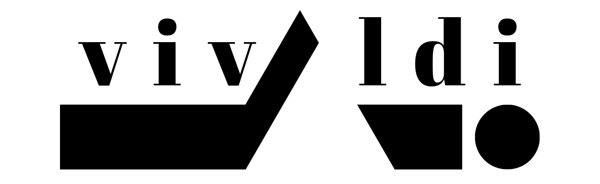

 

# vivaldi

Proyek vivaldi merupakan proyek dokumentasi pengerjaan tesis/penelitian dengan topik "Penggunaan _Recurrent Neural Network_ di bidang sumberdaya air". _Repository_ ini saya gunakan sebagai tempat menyimpan seluruh pekerjaan saya, dari catatan, _jupyter notebook_, pengerjaan tesis, jurnal perkembangan, dlsbnya. 

---

Jika Anda mengunjungi halaman ini karena _jupyter notebook_ saya, berikut pranala penting terkait 

---

## Memulai pekerjaan ala vivaldi

Fokus dari cara pengerjaan vivaldi adalah membagi pekerjaan menjadi bagian kecil yang dapat dilaksanakan (_actionable task_). Agar memudahkan memahami cara pengerjaan ala vivaldi berikut diagram rutinitas peneletian.

 

Sederhananya, dalam mengerjakan penelitian bagilah menjadi empat pekerjaan yaitu Riset _Research_, Belajar _Learning_, Pengembangan _Development_, Laporan _Report_. Dengan membagi setiap _actionable task_ ke masing-masing jenis pekerjaan, akan memudahkan untuk melacak dan mencatat perkembangan penelitian. 

Untuk lebih jelasnya mengenai empat pekerjaan (the four seasons) bisa baca [di halaman ini](./vivaldi/CATATAN_empat_pekerjaan.md).

---

## Struktur _Repository_

Pada proyek ini ada dua bagian utama yaitu bagian penelitian/tesis-nya (_product_) dan cara pengerjaannya (_workflow_). Proyek vivaldi lebih fokus ke cara pengerjaannya, akan tetapi hasil penelitian/tesisnya bisa disertakan juga di dalam repository ini (jika memungkinkan).

### Daftar-daftar Pustaka

Pada bagian pekerjaan 

---

## Tanya Jawab (Tanja)

Kenapa tidak disebut proyek 'rnn-sda' atau 'tesis' ?

> Alasan sederhanya adalah menggantikan kata "tesis/penelitian". Karena dalam proyek ini, saya tidak hanya fokus ke produk laporan tesisnya saja. Saya juga mengeksplorasi pada proses pengerjaannya seperti apa yang saya lakukan setiap harinya (rutinitas), apa yang saya catat, dlsbnya (produktivitas). 
> 
> Karena alasan tersebut, proyek ini bisa disebut sebagai proyek dokumentasi __pengerjaan__ tesis/penelitian. Sehingga pemilihan nama seperti 'rnn-sda' atau 'tesis' dirasa kurang tepat. Fokus dari proyek ini adalah mengeksplorasi berbagai ide dalam menyelesaikan segala bentuk tugas akademis, salah satunya tesis. Dan berharap informasi dari proyek ini bisa digunakan di berbagai kepentingan (seperti pekerjaan).
> 
> Sebelum dinamai vivaldi, proyek ini disebut tesis kemudian rnn-sda.

Kenapa memilih nama "vivaldi"? 
 
> Ini bisa dibilang kebetulan saja. Saat mengerjakan proyek ini, saya sedang ketagihan musik _Recomposed By Max Richter: Vivaldi, The Four Seasons_. Saya langsung ingin menamai proyek ini dengan nama vivaldi.
> 
> Jika ingin berbicara ngawur lebih panjang lagi, seperti di karya _Four Seasons_ yang diartikan sebagai empat musim, di proyek ini juga memiliki empat pekerjaan utama. Alur idealnya dimulai dari riset (spring), belajar (summer), implementasi (autumn), dan diakhiri dengan laporan (winter). Sama halnya dengan musim, pekerjaan itu bisa berulang lagi dari riset. Dan jadilah cocoklogi penamaan vivaldi di proyek ini. 😆😆😆

Kenapa tidak memisahkan antara proyek dokumentasi pengerjaannya dan tesisnya sendiri?

> Karena membagi fokus menjadi dua itu lebih rumit dan kesannya seperti _multi-tasking_. Penggabungan ini memudahkan saya untuk fokus ke pengerjaan tesis saya. 

---